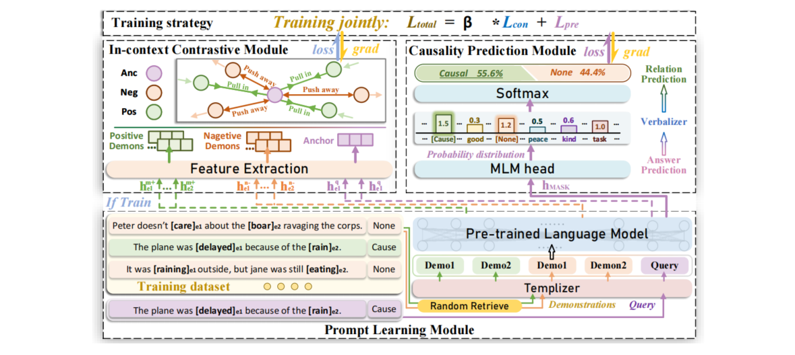

# In-context Contrastive Learning for Event Causality Identification

This is the code of the paper _Identifying while Learning for Document Event Causality Identification_. Accepted by EMNLP 2024.

We propose an **I**n-**C**ontext **C**ontrastive **L**earning (**ICCL**) model for the ECI task. We leverage the causality knowledge of PLM by introducing explicit guidance through the inclusion of demonstrations, rather than relying on the design of complex prompts.

The **ICCL** model contains three modules. **The prompt learning module** reformulates an input event pair and some retrieved demonstrations
into a prompt template, as the input for PLM encoding. **The in-context contrastive module** optimizes the representation of event mention by simultaneously maximizing its agreement with positive demonstrations and minimizing with negative ones, via a contrastive loss. **The causality prediction module** predicts answer word to identify causal relations.
